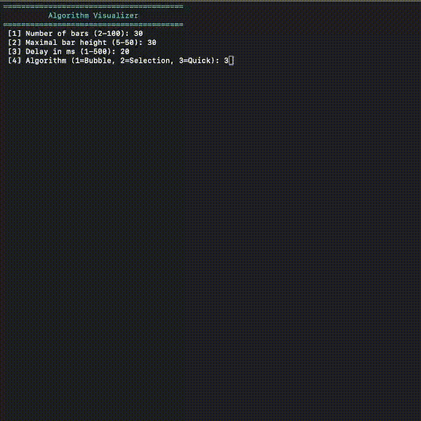

# C++ Algorithm Visualizer 📊

A terminal-based visualizer for sorting algorithms written in C++. With this project I practiced interactive terminal inputs, robust error handling, and live visual updates in the console. Beyond the algorithms themselves I focused on creating a clean, modular architecture using Object-Oriented Programming (OOP) so I can easily add new sorting methods in the future.

## Demo


## ✨ Features
- **Live Visualization:** Smooth, real-time animation of the sorting process directly in the terminal using ANSI escape codes.
- **Interactive CLI Menu:** Customizable parameters for array size, maximum bar height, animation delay, and algorithm selection.
- **Live Statistics:** Tracks and displays the exact number of data comparisons and array swaps for each sorting run.
- **Error-Proof Inputs:** Built-in input validation prevents crashes from incorrect data types or out-of-bounds values.

## 🧮 Implemented Algorithms
- **Bubble Sort:** An iterative algorithm perfect for visually demonstrating in-place swaps.
- **Selection Sort:** Finds the minimum and swaps deliberately. Visually demonstrates maximum efficiency in swap operations.
- **Quick Sort:** A recursive algorithm. Partitions the array around a pivot element for highly efficient sorting of large datasets.

## 🧠 Technical Highlights
- **Custom Visualizer Base:** An abstract base `Visualizer` class that handles all memory management, cursor navigation via ANSI escape codes, and statistics tracking.
- **Modular Architecture (Polymorphism):** New algorithms inherit from the base class and only need to override the `sort()` method. At runtime, a base class pointer dynamically decides which algorithm to execute.
- **Robust Input Handling:** Extracted input validation with `try-catch` blocks and buffer clearing protects the program from crashing due to invalid user inputs.

## ⚙️ Requirements
- C++ compatible compiler (e.g., `g++` or `clang++`)
- Terminal with support for ANSI escape codes (for colors and cursor positioning)

## 🚀 Build & Run
```bash
make
./visualizer
```

## Future Improvements 
- Add benchmark mode (background comparison table for all algorithms)
- Add pre-sort shuffle animation
- Add more algorithms (e.g., Merge Sort or Heap Sort)